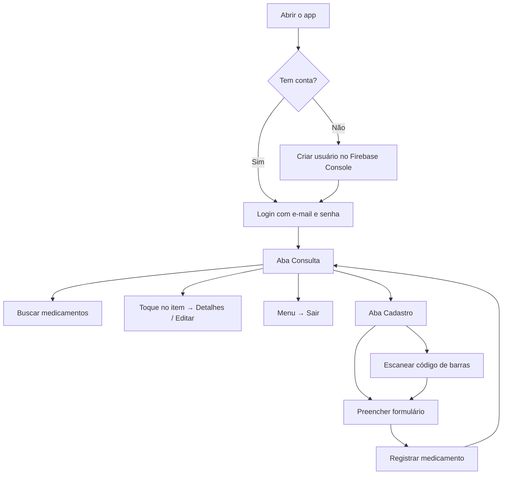

# Medicine Storage


Aplicativo mobile para **controle de estoque pessoal de remédios**. Ele resolve o problema de perder o controle de medicamentos em casa: você consulta o que tem em estoque, cadastra novos itens com validade e quantidade, recebe avisos antes do vencimento e mantém tudo sincronizado na nuvem com sua conta.

Funciona em **Android** e **iOS** (via Expo) e também pode ser aberto no navegador para testes rápidos.

---

## Índice

- [Funcionalidades](#funcionalidades)
- [Pré-requisitos](#pré-requisitos)
- [Instalação](#instalação)
- [Configuração do Firebase](#configuração-do-firebase)
- [Como rodar o projeto](#como-rodar-o-projeto)
- [Como usar o app](#como-usar-o-app)
- [Scripts disponíveis](#scripts-disponíveis)
- [Gerar APK para testes (EAS)](#gerar-apk-para-testes-eas)
- [Estrutura do projeto](#estrutura-do-projeto)
- [Solução de problemas](#solução-de-problemas)
- [Licença](#licença)

---

## Funcionalidades

| Recurso | Descrição |
|---------|-----------|
| **Login** | Acesso com e-mail e senha (Firebase Authentication) |
| **Consulta** | Lista de medicamentos com busca por nome, ordenada por validade |
| **Cadastro** | Formulário com nome, descrição, validade e quantidade |
| **Leitor de código de barras** | Preenche dados do medicamento pela câmera |
| **Detalhes e edição** | Toque em um item para ver e alterar informações |
| **Exclusão com desfazer** | Remove um medicamento e permite desfazer em até 5 segundos |
| **Alertas de validade** | Notificações locais aos 45 dias e entre 1–15 dias do vencimento |
| **Tema claro/escuro** | Interface adapta-se automaticamente ao sistema |

---

## Pré-requisitos

Antes de começar, instale na sua máquina:

| Ferramenta | Versão recomendada | Para quê |
|------------|-------------------|----------|
| [Node.js](https://nodejs.org/) | 18 LTS ou 20 LTS | Executar o projeto e instalar dependências |
| [npm](https://www.npmjs.com/) | Vem com o Node | Gerenciador de pacotes |
| [Git](https://git-scm.com/) | Qualquer versão recente | Clonar o repositório |

**Para testar no celular ou emulador (opcional):**

| Ferramenta | Quando usar |
|------------|-------------|
| [Expo Go](https://expo.dev/go) | Teste rápido no celular físico (Android/iOS) |
| [Android Studio](https://developer.android.com/studio) | Emulador Android |
| [Xcode](https://developer.apple.com/xcode/) | Simulador iOS (somente macOS) |

**Para build de APK (opcional):**

| Ferramenta | Quando usar |
|------------|-------------|
| [EAS CLI](https://docs.expo.dev/build/setup/) | Gerar APK/AAB na nuvem |
| Conta [Expo](https://expo.dev/signup) | Autenticar no EAS |

**Serviços em nuvem (obrigatório para o app funcionar):**

- Projeto no [Firebase Console](https://console.firebase.google.com/) com **Authentication** (e-mail/senha) e **Cloud Firestore** habilitados.

---

## Instalação

### 1. Clonar o repositório

```bash
git clone https://github.com/marcelocataoca/medicine-storage.git
cd medicine-storage
```

### 2. Instalar dependências

```bash
npm install
```

---

## Configuração do Firebase

O app **não funciona** sem as credenciais do Firebase. Siga os passos abaixo.

### Desenvolvimento local

1. Copie o arquivo de exemplo:

```bash
cp .env.example .env
```

2. No [Firebase Console](https://console.firebase.google.com/), abra **Configurações do projeto → Geral** e preencha o `.env` com os valores do app Web/Android:

```env
EXPO_PUBLIC_FIREBASE_API_KEY=sua_chave
EXPO_PUBLIC_FIREBASE_AUTH_DOMAIN=seu_projeto.firebaseapp.com
EXPO_PUBLIC_FIREBASE_PROJECT_ID=seu_projeto
EXPO_PUBLIC_FIREBASE_STORAGE_BUCKET=seu_projeto.appspot.com
EXPO_PUBLIC_FIREBASE_MESSAGING_SENDER_ID=123456789
EXPO_PUBLIC_FIREBASE_APP_ID=1:123456789:android:abcdef
```

3. Baixe o `google-services.json` do app Android no Firebase e coloque na **raiz do projeto** (o arquivo não vai para o Git — veja `.gitignore`).

4. No Firebase Console, ative:
   - **Authentication → Sign-in method → E-mail/senha**
   - **Firestore Database** (modo de produção ou teste, conforme seu ambiente)

5. Crie pelo menos um usuário em **Authentication → Users** (ou implemente cadastro quando disponível) para conseguir fazer login.

> **Importante:** sempre que alterar o `.env`, reinicie o Metro com cache limpo:
>
> ```bash
> npx expo start --clear
> ```

Documentação detalhada para builds na nuvem: [docs/eas-build-secrets.md](docs/eas-build-secrets.md).

---

## Como rodar o projeto

### Iniciar o servidor de desenvolvimento

```bash
npm start
```

Ou, equivalente:

```bash
npx expo start
```

No terminal, você verá um QR code e atalhos:

| Tecla | Ação |
|-------|------|
| `a` | Abrir no emulador Android |
| `i` | Abrir no simulador iOS (macOS) |
| `w` | Abrir no navegador (web) |
| `r` | Recarregar o app |
| `j` | Abrir o debugger |

### Abrir direto em uma plataforma

```bash
# Android (emulador ou dispositivo conectado)
npm run android

# iOS (somente macOS)
npm run ios

# Navegador
npm run web
```

### Testar no celular com Expo Go

1. Instale o app **Expo Go** na loja do seu celular.
2. Execute `npm start` no computador.
3. Escaneie o QR code com a câmera (iOS) ou pelo app Expo Go (Android).
4. Celular e computador devem estar na **mesma rede Wi-Fi**.

> **Nota:** notificações locais e câmera podem ter comportamento limitado no Expo Go. Para testes completos, use um build de desenvolvimento ou APK gerado pelo EAS.

---

## Como usar o app

### Fluxo principal



### Passo a passo

#### 1. Entrar na conta

- Na tela **Entrar**, informe e-mail e senha cadastrados no Firebase.
- Toque em **Entrar**. Você será levado à aba **Consulta**.

#### 2. Consultar medicamentos

- Use o campo de busca para filtrar por nome.
- A lista é ordenada pela data de validade (mais próxima primeiro).
- Cores indicam urgência:
  - **Vermelho** — vence em menos de 30 dias
  - **Amarelo** — vence em menos de 90 dias
  - **Normal** — validade confortável

#### 3. Cadastrar um medicamento

1. Vá à aba **Cadastro** (ícone `+` no rodapé).
2. Preencha:
   - **Nome** (obrigatório)
   - **Descrição** (opcional)
   - **Validade** (obrigatório — seletor de data)
   - **Quantidade** (opcional — número inteiro)
3. Opcional: toque no botão de **código de barras** para ler o rótulo e preencher o nome automaticamente.
4. Toque em **Registrar medicamento**.

#### 4. Editar ou excluir

- **Editar:** toque em um medicamento na lista → altere os campos → **Salvar alterações**.
- **Excluir:** na lista, use o gesto/botão de exclusão → confirme. Um banner **Desfazer** aparece por 5 segundos.

#### 5. Notificações de validade

Com o app aberto e logado, o sistema verifica diariamente medicamentos próximos do vencimento:

| Situação | Comportamento |
|----------|---------------|
| **45 dias** antes | Aviso antecipado (som silenciado entre 22h e 8h) |
| **1 a 15 dias** antes | Aviso crítico (com som) |
| Vários itens no mesmo dia | Uma notificação agrupada |

Permita notificações quando o sistema solicitar.

### Capturas de tela

> Adicione imagens ou GIFs em `docs/screenshots/` e referencie aqui para enriquecer o manual.

<!--
Exemplo (descomente após adicionar as imagens):

| Login | Consulta | Cadastro |
|-------|----------|----------|
|  |  |  |
-->

---

## Scripts disponíveis

| Comando | Descrição |
|---------|-----------|
| `npm start` | Inicia o Expo (Metro bundler) |
| `npm run android` | Abre no Android |
| `npm run ios` | Abre no iOS |
| `npm run web` | Abre no navegador |
| `npm run lint` | Verifica problemas de código (ESLint) |
| `npm test` | Executa os testes (Jest) |
| `npm run test:watch` | Testes em modo observação |
| `npm run test:coverage` | Testes com relatório de cobertura |

---

## Gerar APK para testes (EAS)

Para instalar o app em um Android **sem** Expo Go:

### 1. Instalar e autenticar o EAS CLI

```bash
npm install -g eas-cli
eas login
```

### 2. Configurar variáveis no EAS

As variáveis `EXPO_PUBLIC_FIREBASE_*` precisam estar no painel do EAS (não vão pelo Git). Veja o passo a passo em [docs/eas-build-secrets.md](docs/eas-build-secrets.md).

### 3. Gerar o APK (perfil preview)

```bash
eas build --profile preview --platform android
```

Quando o build terminar, baixe o APK pelo link do Expo e instale no dispositivo.

---

## Estrutura do projeto

```
medicine-storage/
├── app/                      # Rotas (Expo Router)
│   ├── (tabs)/
│   │   ├── index.tsx         # Aba Consulta
│   │   └── medicine-register.tsx  # Aba Cadastro
│   ├── login.tsx             # Tela de login
│   ├── medicine/details.tsx  # Detalhes e edição
│   └── _layout.tsx           # Layout raiz e proteção de rotas
├── components/               # Componentes reutilizáveis de UI
├── hooks/                    # Hooks (tema, notificações de validade)
├── lib/                      # Firebase, medicamentos, notificações
├── constants/                # Cores e tema
├── docs/                     # Documentação complementar
├── .env.example              # Modelo de variáveis de ambiente
├── app.json                  # Configuração Expo
└── eas.json                  # Perfis de build EAS
```

---

## Solução de problemas

| Problema | Possível causa | O que fazer |
|----------|----------------|-------------|
| App abre e fecha na hora | Firebase não configurado | Preencha o `.env` e reinicie com `--clear` |
| `Firebase config ausente` | Variáveis `EXPO_PUBLIC_*` vazias | Confira `.env` ou variáveis no EAS (build) |
| Não consigo fazer login | Usuário inexistente ou senha errada | Crie o usuário no Firebase Console |
| Lista vazia após login | Firestore sem dados ou regras bloqueando | Cadastre um item ou revise as regras do Firestore |
| Câmera não abre | Permissão negada | Aceite a permissão nas configurações do sistema |
| QR code não conecta | Redes diferentes | Use a mesma Wi-Fi no PC e no celular |
| Mudanças no `.env` não aplicam | Cache do Metro | `npx expo start --clear` |

### Regras mínimas do Firestore (desenvolvimento)

Ajuste conforme sua política de segurança. Exemplo para testes com usuário autenticado:

```
rules_version = '2';
service cloud.firestore {
  match /databases/{database}/documents {
    match /medicines/{medicineId} {
      allow read, write: if request.auth != null;
    }
  }
}
```

---

## Licença

Este projeto está sob a licença **0BSD** — veja o campo `license` em `package.json`.

---

## Links úteis

- [Documentação Expo](https://docs.expo.dev/)
- [Expo Router](https://docs.expo.dev/router/introduction/)
- [Firebase para React Native](https://firebase.google.com/docs/web/setup)
- [EAS Build](https://docs.expo.dev/build/introduction/)
